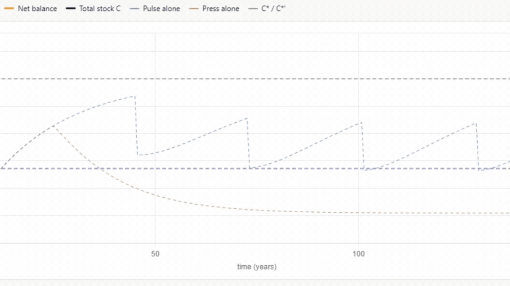

# 1 — Background

*Blue carbon, eelgrass, and why sediment carbon matters.*

[← Back to main guide](../README.md) · Next: [2 — Project Planning →](../02_Project_Planning/)

---

**Quick links:** [Workshop Presentation Slides](BlueCarbon_EelgrassPPT_FinalV1.pptx) · [WWF-Canada Coastal Blue Carbon Guide](https://wwf.ca/wp-content/uploads/2026/04/Coastal-Blue-Carbon-Field-Guide-FINAL.pdf) · [Howard et al. (2014) Blue Carbon Manual](https://www.thebluecarboninitiative.org/manual)

---

## What is blue carbon?

**Blue carbon** is the organic carbon captured and stored by coastal and marine
ecosystems. In Canada, this is principally **seagrass/eelgrass meadows and tidal salt
marshes**. These habitats are among the most efficient carbon sinks on Earth: per unit
area they can bury organic carbon far faster than terrestrial forests, and — because it
is locked into waterlogged, low-oxygen sediment — that carbon can remain stored for
centuries to millennia.

Two things make these systems valuable from a climate perspective:

1. **Sequestration** — living plants pull CO₂ out of the water and atmosphere.
2. **Storage** — the bulk of the carbon accumulates in the *sediment* beneath the
   meadow, not in the plants themselves. This is why our sampling focuses on
   sediment cores rather than biomass alone.

<table>
<tr>
<td width="45%">

</td>
<td width="55%">

The plants, the soil, the water, and the air in this diagram represent the carbon
**pools** ("stocks") — the places that hold carbon at any point in time and can be
directly measured. The arrows represent the **processes** ("fluxes") that move carbon
between the pools. Fluxes over time control the pools, and ultimately the net
sequestration.

</td>
</tr>
</table>

---

## Eelgrass (*Zostera marina*)

Eelgrass is the dominant temperate seagrass across the North Atlantic. As a foundation
species it stabilises sediment, slows water flow (which encourages more particles to
settle and be buried), and supports fisheries and biodiversity — while continuously
adding organic carbon to the seabed.

<table>
<tr>
<td width="45%">

</td>
<td width="55%">

Eelgrass ecosystems accumulate carbon based on two principles:

1. **Autochthonous** — the accumulation of plant material growing within the ecosystem, deposited over time.
2. **Allochthonous** — the accumulation of sediment and plant material transported into the ecosystem from surrounding environments.

</td>
</tr>
</table>

<table>
<tr>
<td width="45%">

</td>
<td width="55%">

Eelgrass sediments typically hold **lower organic carbon concentrations than salt
marsh or mangrove soils**, which is reflected in the quality-control thresholds used
later in the analysis (see [Section 4](../04_Data_Interpretation/)).

</td>
</tr>
</table>

---

## Carbon accumulation and equilibrium

<table>
<tr>
<td width="45%">

</td>
<td width="55%">

The balance of these processes is countered by the decomposition of organic material
via soil microbial processes, and the transport of material out of the ecosystem by
tidal processes. The more sediment accumulates, the more loss occurs over time, until
the ecosystem reaches a balance — referred to as the ecosystem's **carbon equilibrium
state**, or simply "net ecosystem carbon balance."

</td>
</tr>
</table>

<table>
<tr>
<td width="45%">

</td>
<td width="55%">

Healthy ecosystems accumulate carbon over time and respond resiliently to
environmental and human-caused disturbances.

</td>
</tr>
</table>

We can visualize this with a graph — the balance of carbon entering the ecosystem
(green), the loss of carbon (red), and the net balance of these two processes (black).

<table>
<tr>
<td width="60%">

</td>
<td width="40%">

Here is an ecosystem carbon curve, showing the baseline accumulation of carbon over
time as sequestration consistently outpaces loss.

</td>
</tr>
</table>

<table>
<tr>
<td width="60%">

</td>
<td width="40%">

And here is the same ecosystem, but with a disturbance that causes a loss and
recovery of carbon.

</td>
</tr>
</table>

However, if/when multiple overlapping disturbances occur, the ecosystem can continue to
degrade over time, becoming a net emitter of carbon and losing the carbon it had stored.

> 🎥 *Placeholder — add a recording/animation showing this compounding-disturbance case.*

---

## Interactive: Ecosystem Carbon Accumulation Visualizer

Explore how carbon accumulates in coastal ecosystems over time with the interactive
tool built for this workshop:

**👉 [cathald.github.io/CarbonAccumulationVisualizer](https://cathald.github.io/CarbonAccumulationVisualizer/)**

<table>
<tr>
<td width="45%">

</td>
<td width="55%">

Taking a section of the sediment reveals the layers of accumulation over time.

</td>
</tr>
</table>

<table>
<tr>
<td width="45%">

</td>
<td width="55%">

The four steps to completing a carbon project.

</td>
</tr>
</table>

---

## Key references

The workshop follows methods distilled from coastal blue carbon guides, particularly
those focused on the role of the practitioner on the ground, and the project
coordinator planning the project. A consistent guide referenced throughout is the
**"Blue Carbon Manual"**:

> Howard, J., Hoyt, S., Isensee, K., Telszewski, M., & Pidgeon, E. (eds.) (2014).
> *Coastal Blue Carbon: Methods for assessing carbon stocks and emissions factors in
> mangroves, tidal salt marshes, and seagrass meadows.* Conservation International,
> Intergovernmental Oceanographic Commission of UNESCO, International Union for
> Conservation of Nature. Arlington, Virginia, USA.

*(Additional references to be added.)*
