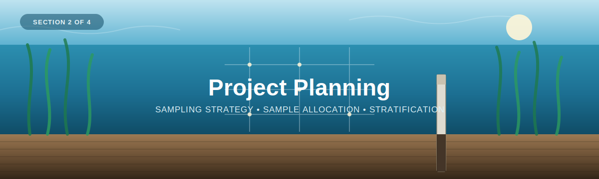

<p align="center">
  
</p>

---

[← 1 — Background](../01_Background/) · [Back to main guide](../README.md) · Next: [3 — Field Methods →](../03_Field_Methods/)

---

# Part 2 — Project Planning: Connecting Data to Project Goals

*Here we'll determine how many samples to take, and where to take them.*


**Quick links:** [Sampling Design Guide](Sampling-Design-Eng-2026.pdf) · [Sample Allocation Calculator](SampleDesign_SampleAllocationCalculator_WithStrata.xlsx) · [Coastal Blue Carbon Field Guide](../Coastal-Blue-Carbon-Field-Guide-FINAL.pdf) · [Howard et al. (2014) Blue Carbon Manual](https://www.thebluecarboninitiative.org/manual)

---

## Why planning matters

Before heading into the field, two questions need answering: **how many samples should
we take, and where should we take them?** Answering these is the aim of a **sampling
design**; in other words, having enough samples, allocated across the ecosystem, to
estimate carbon stock and meet the project's goals.


The following methods are based on WWF-Canada's [Sampling Design guide](Sampling-Design-Eng-2026.pdf), as well
as the sampling-design guidance provided in the [Howard et al. Blue Carbon Manual](https://www.thebluecarboninitiative.org/manual)
(see [Section 1](../01_Background/)).

---
## First, let's consider the following scenario:

You and your team of 4 are tasked with **assessing the baseline measurements of an eelgrass ecosystem before protection and restoration** measures are implemented.

You want to know the 

A) The **average carbon stock** across the meadow, and want to be able to 
B) **Compare these measurements** between different areas of the eelgrass, as well as to future measurements

to assess how different management practices are affecting the ecosystem.

## How would you accomplish this?

Let's break the scenario into digestible parts.

**First**, you want a rough idea of the different areas you're interested in. *This doesn't have to be precise, but it helps to have a general understanding of where those areas are and their boundaries. This helps constrain "where" the measurements will be made. By dividing up the ecosystem, you not only ensure all areas of interest are measured, but you also sample more effectively.*

**Second**, you want to collect samples from within these different areas, so you can "measure" the amount of carbon in these ecosystems. 

But how do you know how many samples to collect and exactly where to take them? This can be answered with a **sampling design**, so let's break it down further.

---
**What is a sampling design?**


<table>
<tr>
<td width="45%">


</td>
<td width="55%">

A sampling design is a framework for choosing what and where to sample to estimate the carbon stored in a larger ecosystem area. Sampling designs allow for the strategic measurement of smaller sections (i.e., sites and plots) within the larger study area. Combining measurements from multiple plots allows us to estimate the value for the study area

</td>
</tr>
</table>

---

### The five steps to a sampling design

The guide breaks *applying* a sampling design into five steps.

1. Identify the boundary of the study area *(Step 1, below)*
2. Stratify the study area *(Step 2, below)*
3. Determine the sample allocation *(Step 4 — "How many samples?", below)*
4. Determine the sample distribution *(Step 5 — "Where to sample?", below)*
5. Select a plot design *(for eelgrass sediment cores, see [Section 3 — Field Methods](../03_Field_Methods/))*


Before we dive into applying these steps, let's first take a step back and consider what we even mean by sampling.

<table>
<tr>
<td width="45%">


</td>
<td width="55%">

**What is sampling?**

Sampling comes from the discipline of "probability-based sampling estimation." This method is applied when you want to measure the amount of something, but it's not feasible to physically measure it because it's too large. Therefore, a small "sample," or portion, of the larger whole is taken to estimate the value of the whole. Each measurement has an associated "probability" — the likelihood the estimate equals the value of the whole — as well as a margin of error, which describes the range of values the estimate falls within, given that probability. Therefore, each estimate has 3 values: an estimate, a probability, and a margin of error.

</td>
</tr>
</table>


We sample when the thing we're interested in measuring can't be counted directly, so we take a small proportion of the total and use it to infer the whole. This is called "probability-based sampling." With probability-based sampling, each estimate comes with a number and a degree of error associated with that number. The goal is to get reasonably close to the true value by reducing that degree of error, and we do this by collecting multiple samples.

To better understand this, let's use the **Sample Allocation Visualizer**.
NOTE: There is a lot of information in this tool, but over the course of this module we'll break down each component, so by the end it will be clear what it means and how it can be used to inform your projects.

<table>
<tr>
<td width="60%">


</td>
<td width="40%">

For starters, let's take a look at the bottom left map. Here we can switch between the "True value" of carbon across the ecosystem — a hypothetical visual representing a world where we could actually measure the entire ecosystem — and the "Revealed" tab, which shows what our estimate is. With each sample collected, the estimate for the area changes. As we keep adding more samples, we see the "True map" lying beneath being revealed more and more. However, it would take thousands of samples to fully uncover it; we're only interested in obtaining a reasonable estimate.

</td>
</tr>
</table>

<table>
<tr>
<td width="60%">


</td>
<td width="40%">

Switching our attention to the right side of the app, here we see the dashed blue line, which is equal to the "true value" we're trying to obtain. As we add more samples, we can see how our estimate compares to this value. In the beginning (with only a few samples), our estimate differs from the true value, and the error range (in purple) is large.

As we add more and more samples, this error is reduced, and our estimate gets closer and closer to the true value.

</td>
</tr>
</table>

Now that we have a better understanding of what sampling is, and how more samples provide more accurate estimates compared to fewer, we can start to plan a carbon sampling project from scratch, following the 5 steps to completing a sampling design.

---

## The Five Steps

## Step 1: Identify the boundary of the study area

<table>
<tr>
<td width="45%">


</td>
<td width="55%">

This can be a simple polygon drawn on a map — such as a boundary drawn in Google Earth
Engine *(link to be added)* — or a pre-defined area.

Alternatively, if you run transects or already know the general area you're interested
in, a simple estimate of the area can be very informative here. For this step, it's not
crucial to measure the exact boundary — a rough guess can be very informative.

</td>
</tr>
</table>


<table>
<tr>
<td width="60%">


</td>
<td width="40%">

Drawing the boundary in practice: outlining a rough study area directly on the map in
Google Earth Engine.

</td>
</tr>
</table>

---

## Step 2: Stratify your site (optional)

In other words, divide your site into distinct areas.

Why? Because we're collecting data at a single point and using it to extrapolate across
a larger area — the more similar that area is to where we sampled, the more accurate our
estimates will be. For example, you wouldn't want to use a sediment sample from an
eelgrass meadow to estimate carbon in an upland marsh; distinguishing between the two
ecosystems gives more accurate results.

Stratification can be done manually, or using remote sensing techniques *(links to be added)*.

<table>
<tr>
<td width="45%">


</td>
<td width="55%">

Stratification divides ecosystems into distinct areas, such that the data we collect in
one area is only applied within that ecosystem. In addition to distinguishing
ecosystems, stratification can also be used to compare different management
techniques, restoration years, etc.

</td>
</tr>
</table>

<table>
<tr>
<td width="60%">


</td>
<td width="40%">

The same boundary being stratified in practice: the [Blue Carbon Hub sampling-design tool](https://blue-carbon-hub.projects.earthengine.app/)
draws the area of interest (Step 1), then applies automatic stratification (Step 2) to
split it into distinct strata before calculating the sample size (Step 3).

</td>
</tr>
</table>

--- 

## Step 3: What to measure


<table>
<tr>
<td width="45%">


</td>
<td width="55%">

Select the **carbon pool** you wish to measure. This can be from the water, the plant,
or the sediment.

</td>
</tr>
</table>

---

## Step 4: How many samples? — Sample allocation

The number of cores needed can be estimated using an area-based approach with
**Cochran's formula** for a desired margin of error and confidence level, given the
variability (standard deviation) of carbon in the ecosystem. This is provided as a
spreadsheet calculator:

<table>
<tr>
<td width="45%">


</td>
<td width="55%">

Provide an area size, allowable error, and precision, and the spreadsheet will provide an estimate for the number of samples to collect.

</td>
</tr>
</table>

<table>
<tr>
<td width="45%">


</td>
<td width="55%">

A model is only as useful as the information you provide it. Here we use the same formula, but provide more information: a study area boundary, which gives the model a more precise measure of area, and a regional estimate for the mean and std of the estimated carbon stock.

</td>
</tr>
</table>


**📄 [`SampleDesign_SampleAllocationCalculator_WithStrata.xlsx`](SampleDesign_SampleAllocationCalculator_WithStrata.xlsx)**

This is the **"Sample Design Sample Allocation Calculator"** named directly in the
Sampling Design guide's Step 3:

> "This framework uses the central limit theorem to estimate the minimum number of
> plots needed to meet a desired level of accuracy and precision for estimating the
> carbon stock of a large area."

> "For example, if the study area is 10,000 km² and the allowable error is 10%, 43 plots will need to be set up."

For more information, please see WWF-Canada, *[Carbon Measurement: Sampling Design](Sampling-Design-Eng-2026.pdf)* (2026), p.16.

The spreadsheet has three sheets:

### Sheet 1 — Sample Allocation Calculator
Estimates the total number of plots/cores (*n*) for the whole study area.

| Input | Meaning |
|-------|---------|
| Size of total study area (m²) | The area you want to characterise |
| Margin of error | Acceptable relative error (e.g. `0.2` = ±20%) |
| Confidence level (alpha) | Precision level (e.g. `0.1` → 90% confidence) |
| Carbon mean & standard deviation | Expected carbon and its variability. Two options: **Tier 2** — use the provided WWF-Canada carbon-map defaults, or **Tier 1** — enter your own measured mean and standard deviation as the prior |

**Output:** number of plots *n* needed to hit the target precision.

### Sheet 2 — Sample Allocation per Strata
Splits the total *n* across **strata** (sub-areas — e.g. dense vs. sparse meadow,
depth zones) in proportion to each stratum's area, with a **minimum of 5 plots per
stratum**. Enter each stratum's size and the sheet returns the proportion and the
number of plots to allocate — the same proportional-allocation principle the guide
describes for stratified-random sampling:

> "Allocate (Step 3 'Sample allocation') plots proportionally based on the size of each
> study site (e.g., a 50ha area will have twice as many plots as a 25ha area)."
>
> — WWF-Canada, *[Carbon Measurement: Sampling Design](Sampling-Design-Eng-2026.pdf)* (2026), p.17


---

## Step 5: Where to sample? — Stratification & sample distribution

Lastly, where to take these samples?

<table>
<tr>
<td width="45%">


</td>
<td width="55%">

There are different strategies for distributing samples, aptly referred to as "sampling strategies."

These include convenient, linear, grid, and stratified sampling.

</td>
</tr>
</table>

<table>
<tr>
<td width="45%">


</td>
<td width="55%">

For eelgrass, some considerations include how the eelgrass might vary relative to the shore, both parallel and perpendicular.

</td>
</tr>
</table>

Rather than scattering cores at random, the meadow is divided into **strata** and
samples are allocated across them (Sheet 2 above). Stratifying by features that drive
carbon variability — meadow density, water depth, sediment type — gives a more precise
estimate for the same number of cores and ensures no part of the site is missed.

The guide names four sampling strategies for deciding *where* plots go; which one fits
depends on how much you already know about the site:

| Strategy | When to use it |
|---|---|
| **Random** | Plots placed randomly across the study area — the default when the area is uniform or there's no prior data. |
| **Systematic** | Plots at regular intervals — guarantees even coverage, but only when variation across the site is already known. |
| **Stratified-random** | Study area divided into strata first, then plots randomly assigned within each — most accurate and cost-effective when variability is known. **This is the strategy used here.** |
| **Convenience/practical** | Plots placed wherever is accessible — not statistically rigorous, but useful for a low-cost initial assessment. |


Stratification (optional) is used to divide the study area into smaller, distinct sites. This process can reduce the cost of sampling by increasing the statistical power of your field data.

For more information, please see WWF-Canada, *[Measuring Carbon in Coastal Sediments](../Coastal-Blue-Carbon-Field-Guide-FINAL.pdf)* (2026), p.6.

For eelgrass specifically, the field guide recommends a shoreline-aligned transect layout:

Seagrass meadows should be sampled along transects that run parallel to the shoreline and align with the depth of the sediment. Within each site, a random or probability-based grid sampling strategy is recommended, with at least two replicates per site.


> 🎥 **CHECK OUT THE VIDEO** — *"Site Selection and Required Materials"* · [workshop playlist](https://www.youtube.com/playlist?list=PLLsjpJMfNDP5w78ZJNDUvMj1VoRG_qSwd) *(swap in the direct video link)*

---

## Companion tools — WWF-Canada Blue Carbon Sampling Design Tools

The area-based calculator here is part of a broader set of sampling-design tools
developed previously for blue carbon work:

- **Interactive tool:** [Blue Carbon Hub sampling-design app](https://blue-carbon-hub.projects.earthengine.app/)
- **Source code:** [WWF-Canada-SKI/Carbon-Measurement — Sampling Design Tools](https://github.com/WWF-Canada-SKI/Carbon-Measurement/tree/main/Blue%20Carbon/Sampling%20Design%20Tools)

<table>
<tr>
<td width="50%">


</td>
<td width="50%">


</td>
</tr>
<tr>
<td width="50%">

The sample size visualizer shows how you can reveal the "true carbon" using sampling.
How many samples are required to reach a goal can vary based on the adjustable
parameters listed.

</td>
<td width="50%">

This sampling tool helps implement this in a practical way, allowing the user to adjust
these parameters over a user-defined study area. The user can choose if/how they want
to divide up (stratify) their study area, and allocate their samples.

</td>
</tr>
</table>

---
## Putting it into practice — examples of implementing this workflow

**Scenario:** You are interested in understanding a baseline carbon stock in an inlet containing eelgrass. For planning, you need to know:

A) How many samples to take
B) Where to take them

So you begin to implement the steps:

**Step 1 — Area.** Using the Google Earth Engine sampling-design tool, you draw a rough outline of the area you know is mostly eelgrass.


**Step 2 — Stratify.** You know there are slight differences across the site, so you use the "Auto-Stratification" tool to help delineate unique areas.

**Step 3 — What to measure.** You only want to measure sediments in this area.

**Step 4 — How many samples.** You calculate the required number of samples in this area based on:
- Total area =
- Level of precision =
- Margin of error =
- Default estimate for C stock and variation =

...using the calculator's built-in calculation function.

**Step 5 — Where to sample.** You allocate this number of samples proportionally across the two strata.

Next, you send these coordinates to your team to go and collect the samples.

**Summary of what to expect:** *Given the size of the area and your intended goals, we "insert summary."*


---

## In this section

- [`SampleDesign_SampleAllocationCalculator_WithStrata.xlsx`](SampleDesign_SampleAllocationCalculator_WithStrata.xlsx) — the Cochran's-formula calculator.
- [`Sampling-Design-Eng-2026.pdf`](Sampling-Design-Eng-2026.pdf) — the WWF-Canada sampling-design guide.
- `images/` — screenshots of the calculator and planning materials.

<details>
<summary><b>📋 Slide/screenshot layout template — copy/paste this to add an image</b></summary>

Each image is a two-column block: the image on the left and a description on the right.
To add one, copy the block below and:

1. In GitHub's editor, click inside the left cell (between the blank lines) and **paste
   or drag your image** — or paste the image URL into `src="…"`.
2. Type your description in the right cell (plain text, **markdown**, links, and lists
   all work).

Keep the blank lines inside the cells — they're what let GitHub render the pasted
image and formatted text.

```html
<table>
<tr>
<td width="45%">


</td>
<td width="55%">

Paste your description here.

</td>
</tr>
</table>
```

</details>
