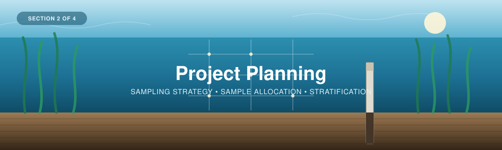

<p align="center">
  
</p>

---

[← 1 — Background](../01_Background/) · [Back to main guide](../README.md) · Next: [3 — Field Methods →](../03_Field_Methods/)

---

# Part 2 — Project Planning
## From a carbon question to a sampling design

Before collecting sediment cores, its worth considering these four questions:

1. **What do I want to know?** - Are you collecting baseline data? Interested in comparing different management types?
2. **Where does that question apply?** What areas do I want to know about? Is it the whole ecosystem? Just the eelgrass? High-meadow vs low?
3. **How much data do I need?** How many samples is enough? Can I estimate this before planning to see if it fits my budget?
4. **Where should I collect samples?** Where exactly should I be collecting data from?

This section turns the answer to these questions into a plan

**Quick links:** [Sampling Design Guide](Sampling-Design-Eng-2026.pdf) · [Sample Allocation Calculator](SampleDesign_SampleAllocationCalculator_WithStrata.xlsx) · [Coastal Blue Carbon Field Guide](../Coastal-Blue-Carbon-Field-Guide-FINAL.pdf) · [Howard et al. (2014) Blue Carbon Manual](https://www.thebluecarboninitiative.org/manual)

---

### What you'll have at the end of this section

```        
  ✓  Study area boundary                    
  ✓  Ecosystem strata (if you need them)    
  ✓  Carbon pool selected                   
  ✓  Required number of cores               
  ✓  Sampling locations to collect sediment core data                                          
```

### The road from here to the field

```
        Your carbon question
                 │
                 ▼
   1.  Study area boundary          ── where am I working?
                 │
                 ▼
   2.  Stratification               ── does it split into zones?
                 │
                 ▼
   3.  Carbon pool                  ── what am I measuring?
                 │
                 ▼
   4.  Sample size                  ── how many cores?
                 │
                 ▼
   5.  Sample locations             ── where do they go?
                 │
                 ▼
        Field collection  →  Section 3
```

Each of the five steps below follows the same shape: **why it matters**, **what the Tsawwassen
team did**, **your turn**, and **what you should have** before moving on.

---

## Why planning matters

This section is the workshop's **making the data useful** component (see the
[main guide](../README.md)). Before you collect any sediment samples — the ones that will fill
in the [data sheet](../04_Data_Interpretation/) — it's worth making sure what you are collecting
will actually answer your team's questions. That's what a **sampling design** aims to accomplish.

Two questions are worth considering: **how many samples should you take, and where should you
take them?** A sampling design ensures you have enough samples, allocated across the ecosystem,
to estimate carbon stock and meet the project's goals.


The following methods are based on WWF-Canada's [Sampling Design guide](Sampling-Design-Eng-2026.pdf), as well
as the sampling-design guidance provided in the [Howard et al. Blue Carbon Manual](https://www.thebluecarboninitiative.org/manual)
(see [Section 1](../01_Background/)).

---

## Worked example — meet the team at Tsawwassen Beach

> [!TIP]
> **This is the worked example.** One small team in British Columbia, followed from planning
> through fieldwork to carbon estimates. It runs through **every part of this workshop**, so you
> can watch one project end to end. The complete version — data sheets, analysis and results —
> lives in [`Worked_Example/`](../Worked_Example/).
>
> Follow it to see the shape of a project. Don't copy its numbers: yours will differ.

Here we meet a small team working in B.C., aiming to gather baseline carbon data in the
**Tsawwassen Beach marshes**.

You and your team of 4 are tasked with **assessing the baseline measurements of an eelgrass ecosystem before protection and restoration** measures are implemented.

You want to know two things:

A) The **average carbon stock** across the meadow, and want to be able to

B) **Compare these measurements** between different areas of the eelgrass, as well as to future measurements
to assess how different management practices are affecting the ecosystem.

**How would you accomplish this?**
Let's break the scenario into digestible parts.

**First**, you want a rough idea of the different areas you're interested in. *This doesn't have to be precise, but it helps to have a general understanding of where those areas are and their boundaries. This helps constrain "where" the measurements will be made. By dividing up the ecosystem, you not only ensure all areas of interest are measured, but you also sample more effectively.*

**Second**, you want to collect samples from within these different areas, so you can "measure" the amount of carbon in these ecosystems.

But how do you know how many samples to collect and exactly where to take them? This can be answered with a **sampling design**.

---

## What is a sampling design?

A sampling design in this workshop is a framework for choosing what and where to sample to estimate the carbon stored in a larger ecosystem area.

<table>
<tr>
<td width="60%">


</td>
<td width="40%">

Sampling designs allow for the strategic measurement of smaller sections (i.e., sites and plots) within the larger study area. Combining measurements from multiple plots allows us to estimate the value for the study area.

</td>
</tr>
</table>

---

## The sampling roadmap in five steps

The guide breaks *applying* a sampling design into **five steps**.

| # | Step | Answers |
|---|------|---------|
| 1 | **Identify the boundary** of the study area | *Where, roughly, am I working?* |
| 2 | **Stratify** the study area (optional) | *Does the site split into distinct areas?* |
| 3 | **Choose what to measure** — the carbon pool | *Water, plant, or sediment carbon?* |
| 4 | **Determine how many samples** to take | *How many cores meet my intended goal?* |
| 5 | **Determine where to sample** — distribution | *Where exactly do I collect sample and data from?* |

Selecting a plot design (the physical layout of each core) follows from these; for eelgrass
sediment cores, see [Section 3 — Field Methods](../03_Field_Methods/).

---

## Background — what sampling is and why it works

> [!NOTE]
> **This part is background, not instructions.** It explains *why* the sampling maths works.
> You do not need to follow the derivation to run a campaign — the five steps above and the
> calculator will get you there. Read it when you want to understand what the numbers mean, or
> when you need to defend them to a reviewer.

**Sampling** is based on probability-based estimation methods. It is used when directly measuring an entire population or area is impractical because of its size. Instead, a small sample is measured and used to estimate the value of the whole.

<table>
<tr>
<td width="60%">


</td>
<td width="40%">

**What is sampling?**

Sampling implies we are collecting small portions of a larger whole to estimate a "value" (in this case carbon) of that larger whole.

</td>
</tr>
</table>

The more samples you collect, the more precisely you can estimate the true value — the value you would obtain if you could measure the entire ecosystem. Because only a subset of the ecosystem is sampled, every estimate contains some uncertainty. A probability-based sampling result is therefore reported as three parts:

| Component | Symbol | What it tells you |
|---|---|---|
| **Estimate** (the mean) | $\bar{x}$ | Your best estimate of the carbon value, calculated as the average across all sampled plots. |
| **Confidence level** | $1-\alpha$ | Describes how often the sampling procedure would capture the true value if repeated many times. For example, a 95% confidence level means that about 95 out of every 100 confidence intervals produced by the same sampling method would contain the true value |
| **Margin of error** | $E$ | Describes the precision of the estimate. It is the distance from the estimate to the edge of the confidence interval and is often reported relative to the estimate (e.g., ±10%). Smaller margins of error indicate more precise estimates |

Put together, a result reads: *"mean carbon = $\bar{x}$, with 95% confidence, ±10%."* The estimate is what you use; the confidence and margin of error are what make it defensible.

When designing a sampling campaign, you choose the desired confidence level and margin of error. The required sample size is then calculated to achieve those goals.

### Seeing it — more samples, tighter estimate

The Sample Allocation Visualizer makes this concrete:

<table>
<tr>
<td width="60%">


</td>
<td width="40%">

Look at the bottom-left map. You can switch between the **"True value"** of carbon across the ecosystem — a hypothetical world where we could measure everything — and the **"Revealed"** view, which shows our estimate. With each sample collected, the estimate updates, and the true map underneath is revealed a little more. It would take thousands of samples to fully uncover it — but we only need a *reasonable* estimate, not a perfect one.

</td>
</tr>
</table>

<table>
<tr>
<td width="60%">


</td>
<td width="40%">

On the right, the dashed blue line is the **true value** we're trying to reach. With only a few samples, our estimate is off and the error range (purple) is wide. As samples accumulate, the error shrinks and the estimate closes in on the truth. **That purple band is $E$, your margin of error** — watch it narrow as *n* grows.

</td>
</tr>
</table>


### The takeaway — sampling is a planning tool, not just a reporting one

Probability-based sampling does two jobs for a project:

- The same methods that let us **estimate something too large to measure** also let us test
  whether changes *within* or *between* sites are statistically verifiable.
- By **rearranging the formula**, we can work backwards — from the precision we want, to the
  number of samples needed to get there.

That second point is what turns statistics into a planning tool. The algebra behind it is worth
seeing once — but you never have to do it by hand, so it's folded away here.

<details>
<summary><b>Rearranging to get Cochran's sample size</b> &nbsp;·&nbsp; <i>show the derivation</i></summary>

<br>

Start from what a margin of error *is* — the z-multiplier times the standard error of the mean:

$$E \cdot \bar{x} = z\,\frac{s}{\sqrt{n}}$$

Solve that for $n$, and write the variability as a **coefficient of variation**, $CV = s/\bar{x}$,
so the result is scale-free — it no longer depends on the units carbon is measured in:

$$n = \left(\frac{z \cdot CV}{E}\right)^{2}$$

This is the infinite-population form: it assumes your study area could hold unlimited plots.
Real sites cannot, so Cochran's correction accounts for a **finite** number of possible plot
locations $N$ (your study area ÷ your plot size):

$$n \geq \frac{z^2\, N\, CV^2}{(N-1)\,E^2 + z^2\, CV^2}$$

Read the two forms together and the behaviour of the whole method falls out: $E$ and $CV$ are
both **squared**, so precision and patchiness dominate the cost of a campaign — while $N$ only
matters when the area is small enough that plots are genuinely scarce.

</details>

###### ▲ END BACKGROUND — back to implementation. That was the reasoning behind Step 4; now we walk the five steps, starting with the boundary.

---

## Step 1 — Define your study area

*Where, roughly, am I working?*

> [!NOTE]
> **🎓 Why this matters.** Every number you produce later is *per unit area*, so the boundary
> is what turns a carbon density into a carbon total. It also sets $N$ — the number of possible
> plot locations — which feeds the sample-size calculation in Step 4.
>
> It does **not** need to be precise. A rough outline of where the meadow is beats a perfect
> outline of the wrong thing.

<details>
<summary><b>📊 What the Tsawwassen team did</b></summary>

<br>

Using the Google Earth Engine sampling-design tool, they drew a rough outline of the area they
knew was mostly eelgrass — a **5 ha inlet (50,000 m²)**. They did not survey the edge; they
traced what they could see on recent imagery.


</details>

### 🛠 Your turn

<table>
<tr>
<td width="45%">


</td>
<td width="55%">

Draw a simple polygon on a map — in the
[Blue Carbon Hub tool](https://blue-carbon-hub.projects.earthengine.app/), in Google Earth
Engine, or in whatever GIS you already use — or take a pre-defined area if one exists.

If you run transects, or already know the general area you're interested in, a simple estimate
of the area is enough. A rough guess is genuinely informative here.

</td>
</tr>
</table>

<table>
<tr>
<td width="45%">


</td>
<td width="55%">

**In practice:** outlining a rough study area directly on the map in Google Earth Engine.

</td>
</tr>
</table>

> [!TIP]
> **✅ Before moving on, you should have:**
> - A boundary polygon (or a sketched area on a map)
> - Its **total area in m²** — you'll need this number in Step 4

---

## Step 2: Stratify your site (optional)

*Does the site split into distinct areas?* In other words, divide your site into distinct areas.

Why? Because we're collecting data at a single point and using it to extrapolate across
a larger area — the more similar that area is to where we sampled, the more accurate our
estimates will be. For example, you wouldn't want to use a sediment sample from an
eelgrass meadow to estimate carbon in an upland marsh; distinguishing between the two
ecosystems gives more accurate results.

Stratification can be done manually, or using remote sensing techniques *(links to be added)*.

<table>
<tr>
<td width="45%">


</td>
<td width="55%">

Stratification divides ecosystems into distinct areas, such that the data we collect in
one area is only applied within that ecosystem. In addition to distinguishing
ecosystems, stratification can also be used to compare different management
techniques, restoration years, etc.

</td>
</tr>
</table>

<table>
<tr>
<td width="45%">


</td>
<td width="55%">

**In practice:** the [Blue Carbon Hub sampling-design tool](https://blue-carbon-hub.projects.earthengine.app/)
draws the area of interest (Step 1), then applies automatic stratification (Step 2) to
split it into distinct strata before calculating the sample size (Step 4).

</td>
</tr>
</table>

---

## Step 3: What to measure

*Water, plant, or sediment carbon?*

<table>
<tr>
<td width="45%">


</td>
<td width="55%">

Select the **carbon pool** you wish to measure. This can be from the water, the plant,
or the sediment. For an eelgrass carbon project, this is the **sediment**.

</td>
</tr>
</table>

---

## Step 4 — Decide how many samples

*How many cores meet my precision goal?*

> [!NOTE]
> **🎓 Why this matters.** This is the step that decides your budget and your field schedule —
> and the one most likely to be challenged by a reviewer. Too few cores and your estimate
> carries an interval too wide to act on; too many and you spend a season collecting data you
> didn't need.
>
> You set two things — **how precise** you need to be, and **how confident** — then describe how
> variable you expect the meadow to be. The calculator returns the number of cores. You never
> work the formula by hand, but it pays to know which inputs actually move the answer.

<details>
<summary><b>📊 What the Tsawwassen team did</b></summary>

<br>

They calculated the required number of cores from:

- Total area = **50,000 m²** (the 5 ha inlet from Step 1) → at **100 m² per plot**, $N$ = **500** possible plots
- Confidence level = **90%** → $z = 1.645$
- Margin of error = **±10%** ($E = 0.10$)
- Prior mean and variation = **≈ 120 Mg C ha⁻¹, SD ≈ 60** (regional WWF-Canada carbon map) → $CV = 0.5$

That returns **≈ 60 cores**. Padding for ~70% usable-sample recovery — attrition, lost cores,
damaged samples — they planned to collect **≈ 86**.

</details>

### What moves the answer

### What drives sample size?

Four inputs dominate, and two of them sit **squared** in the formula, so small changes have
outsized effects.

First, one modelling choice that everything else depends on: **each core is taken to represent a
plot, not a pinprick.** We use a **10 × 10 m plot (100 m²)** per core. That converts your study
area into the number of possible plot locations, $N$ — a 5 ha inlet holds 500 of them. Change the
plot size and every number below shifts.

The table is anchored on the worked example: a **5 ha inlet** ($N$ = 500 plots), ±10% margin of
error, 90% confidence, CV 0.5 → **≈ 60 cores**. One knob at a time:

```
                                              cores needed (from 60)
  Precision      ±10% → ±5%      ████████████████████████  176
  Variability    CV 0.5 → 1.0    ████████████████████████  176
  Confidence     90% → 95%       ███████████               81
  Study area     5 ha → 50 ha    █████████                 67
```

| Knob | Turn it… | Effect on cores (*n*) | Why |
|---|---|---|---|
| **Margin of error, $E$** | tighter: ±10% → ±5% | **~3× more** (60 → ~176) | $E$ is squared |
| **Variability, $CV = s/\bar{x}$** | patchier: 0.5 → 1.0 | **~3× more** (60 → ~176) | also squared |
| **Confidence, $1-\alpha$** | stricter: 90% → 95% | **~35% more** (60 → ~81) | more certainty costs cores, far less steeply |
| **Study area** | bigger: 5 ha → 50 ha | **~10% more** (60 → ~67) | rises, then plateaus — see below |

Three things here routinely surprise people:

- **CV is the hidden driver.** It's squared, exactly like $E$ — so a meadow twice as variable
  needs roughly **three times** the cores. This is why a good variability prior matters more than
  almost any other input, and why you pad it when you're unsure.
- **Precision is expensive, confidence is cheap.** Tightening your margin of error from ±10% to
  ±5% nearly triples the fieldwork. Raising confidence from 90% to 95% costs about a third more.
  If the budget is fixed, loosening $E$ buys back far more cores than dropping confidence.
- **Area matters at first, then stops.** Going 1 ha → 5 ha → 50 ha → 500 ha gives roughly
  **41 → 60 → 67 → 68** cores. Sample size climbs while the area is small relative to the plot
  size, then flattens out. **Doubling a large meadow does not double your cores** — you're
  estimating a *mean*, and pinning down a mean depends on variability, not on the size of the
  field.

> **Why "~3×" and not "4×"?** In a large area the squared terms give a clean fourfold: halving
> $E$ takes *n* from 68 to 271. In a 5 ha inlet there are only 500 possible plots, so the
> **finite-population correction** — the $(N-1)$ term — pulls the requirement back to about 3×.
> The smaller your study area, the more it dampens these effects.

<details>
<summary>📐 <b>Show the math — the sample-size formula and its symbols</b></summary>

<br>

For a continuous variable like carbon stock:

$$n \geq \frac{z^2\, N\, CV^2}{(N-1)\,E^2 + z^2\, CV^2}, \qquad CV=\frac{s}{\bar{x}}$$

For a **proportion** parameter instead (e.g. % of cores containing a peat horizon, % meadow still vegetated), swap in the proportion form — use $p = 0.5$ when you have no prior, since it gives the largest, most conservative $n$:

$$n \geq \frac{z^2\, N\, p\,q}{(N-1)\,E^2 p^2 + z^2\, p\, q}, \qquad q = 1-p$$

**Inputs you supply:**

| Input | What it is | Where it comes from |
|---|---|---|
| $N$ | Max possible plots = total study area ÷ plot footprint | Your Step 1 boundary |
| $1-\alpha$ | Confidence level → sets $z$ (1.645 → 90%, 1.96 → 95%) | You choose (usually 90% or 95%) |
| $E$ | Acceptable margin of error | You choose (e.g. ±10%) |
| $\bar{x}$ | Expected mean carbon | Prior study, regional map, or pilot data |
| $s$ | Expected standard deviation | Prior study, regional map, or pilot data |

**Symbol crosswalk to the UNFCCC A6.4 tool** (if you're cross-referencing the [UNFCCC A6.4 Sampling & Surveys tool](Sampling-Design-Eng-2026.pdf) or its calculator):

| This guide | UNFCCC tool | Meaning |
|---|---|---|
| $z$ | $Z_{\alpha/2}$ | z-multiplier set by confidence level |
| $E$ | $e_{abs}$ | target **relative** precision (0.10 = ±10% of the mean) |
| $s$ | $SD$ | expected standard deviation (your prior) |
| $\bar{x}$ | mean | expected mean (your prior) |
| $CV$ | $CV$ | coefficient of variation, $s/\bar{x}$ |
| $N$ | $N$ | population size (see note below) |
| $n$ | $n$ | number of plots/cores to collect |

> **Note on $N$ — this is where the two calculators differ.** The core formula is identical in the WWF-Canada area-based calculator and the UNFCCC A6.4 tool. They only differ in how $N$ is obtained: the WWF tool derives it from **total area ÷ plot size**, while the UNFCCC tool takes a **population count** ($N$) directly. Because $(N-1)$ barely moves the result once $N$ is large, both converge on the same answer — which is exactly why area "doesn't matter" above.

</details>

### See it for yourself

The quickest way to build intuition is to open the calculator (or the
[Blue Carbon Hub visualizer](https://blue-carbon-hub.projects.earthengine.app/)) and change **one
knob at a time**, watching *n* respond:

<table>
<tr>
<td width="45%">

> 📸 **[SCREENSHOT/GIF NEEDED]** — margin-of-error comparison: the calculator at **±20% vs ±10%**, side by side, with the *n* readout circled (~17 vs ~68) to show the ~4× jump.

</td>
<td width="55%">

> 📸 **[SCREENSHOT/GIF NEEDED]** — variability comparison: a **smooth vs patchy meadow** at the same target precision, showing *n* roughly quadruple as CV goes 0.5 → 1.0.

</td>
</tr>
</table>

### The calculator

The formula above is provided as a spreadsheet calculator.

<table>
<tr>
<td width="45%">


</td>
<td width="55%">

Provide an area size, allowable error, and precision, and the spreadsheet estimates the number of samples to collect.

</td>
</tr>
</table>

<table>
<tr>
<td width="45%">


</td>
<td width="55%">

A model is only as useful as the information you give it. Here we use the same formula but provide more: a study area boundary (a more precise measure of area) and a regional estimate for the mean and standard deviation of carbon stock.

</td>
</tr>
</table>


**📄 [`SampleDesign_SampleAllocationCalculator_WithStrata.xlsx`](SampleDesign_SampleAllocationCalculator_WithStrata.xlsx)**

This is the **"Sample Design Sample Allocation Calculator"** named directly in the
Sampling Design guide's Step 3:

> "This framework uses the central limit theorem to estimate the minimum number of
> plots needed to meet a desired level of accuracy and precision for estimating the
> carbon stock of a large area."

> "For example, if the study area is 10,000 km² and the allowable error is 10%, 43 plots will need to be set up."

For more information, please see WWF-Canada, *[Carbon Measurement: Sampling Design](Sampling-Design-Eng-2026.pdf)* (2026), p.16.

The spreadsheet has three sheets:

#### Sheet 1 — Sample Allocation Calculator
Estimates the total number of plots/cores (*n*) for the whole study area.

| Input | Meaning |
|-------|---------|
| Size of total study area (m²) | The area you want to characterise |
| Margin of error | Acceptable relative error (e.g. `0.2` = ±20%) |
| Confidence level (alpha) | Precision level (e.g. `0.1` → 90% confidence) |
| Carbon mean & standard deviation | Your **prior** — see below |

**Output:** number of plots *n* needed to hit the target precision.

> 🎯 **Where the mean and SD come from — this is an educated guess, and that's fine.**
> The calculator needs to know roughly how much carbon is there and how variable it is
> *before* you've measured anything. That's a chicken-and-egg problem, and the answer is a
> **prior**: a rough estimate from existing information, used only to size the campaign.
> The sheet offers two sources, in order of preference:
>
> | Source | Use when | How good is it? |
> |---|---|---|
> | **Your own data** — measured mean and SD from a pilot, a previous survey, or nearby cores | You have local measurements | Best. Local variability is what actually drives *n*. |
> | **Regional defaults** — the provided WWF-Canada carbon-map values | You have nothing local | Workable starting point. Regional averages usually *understate* local patchiness, so pad the SD. |
>
> You are not committing to these numbers — nothing in your final result depends on them.
> They only decide how many cores to plan for. After the campaign you check the precision
> you *actually* achieved (see below), which is what gets reported.
>
> ⚠️ **A note on the word "Tier."** The sheet labels these prior sources "Tier 1" and
> "Tier 2." That numbering refers **only to where your prior came from** and is unrelated
> to the IPCC Tier 1/2/3 methodological tiers used in national greenhouse gas inventory
> reporting. If you work with IPCC guidance, read these labels as "prior source," not as a
> statement about method quality.

#### Sheet 2 — Sample Allocation per Strata
Splits the total *n* across **strata** (sub-areas — e.g. dense vs. sparse meadow,
depth zones) in proportion to each stratum's area, with a **minimum of 5 plots per
stratum**. Enter each stratum's size and the sheet returns the proportion and the
number of plots to allocate — the same proportional-allocation principle the guide
describes for stratified-random sampling (see Step 5):

> "Allocate (Step 3 'Sample allocation') plots proportionally based on the size of each
> study site (e.g., a 50ha area will have twice as many plots as a 25ha area)."
>
> — WWF-Canada, *[Carbon Measurement: Sampling Design](Sampling-Design-Eng-2026.pdf)* (2026), p.17

<!-- TODO (Cathal): the intro above says the workbook has THREE sheets, but only Sheet 1 and Sheet 2 are documented. Add a "Sheet 3" description here, or change "three sheets" to "two sheets". -->


### After the campaign: did you actually hit your precision target?

Sample-size planning uses *expected* variability. Once real cores come back, the observed spread can differ — so before trusting the estimate, check the **achieved** precision against your target. The calculator's post-survey check cells do this for you: they compute a **relative margin of error (RME)** from your actual cores and compare it to the target $E$ you planned for. If RME is at or below your target, the estimate meets its reliability criterion and you're done.

<details>
<summary>📐 <b>Show the math — achieved precision (RME)</b></summary>

<br>

For a mean parameter:

$$\text{RME} = \frac{z \cdot SE}{\bar{x}}, \qquad SE = \sqrt{\left(1-\tfrac{n}{N}\right)\frac{s^2}{n}}$$

where $s$ and $\bar{x}$ are now the *sample* standard deviation and mean, and $\text{RME}$ (relative margin of error) is compared to your target $E$.

</details>

**If you miss it:** work down the ladder — scrutinize the raw data for outliers or skew, then post-stratify, then add cores; only as a last resort, report the conservative confidence bound (the interval end that *understates* carbon) so the estimate is defensible.

<!-- TODO (Cathal): a small screenshot/GIF of the calculator's "check precision after survey" cells (SRS-Mean rows for SE, t-value, relative precision) would slot in well here. -->

> [!WARNING]
> **⚠️ A common mistake.** *"I collected 10 cores, so I have a carbon estimate."*
>
> You have an estimate — but not necessarily a **defensible** one. A carbon number without a
> margin of error can't be compared to another site, to a future survey, or to a target. The
> sample size is what buys you the interval, and the interval is what makes the number usable.

> [!TIP]
> **✅ Before moving on, you should have:**
> - A **target margin of error** and **confidence level** you can justify
> - A **prior** for mean carbon and its variability, and a note of where it came from
> - A **required number of cores** from the calculator
> - That number **padded for recovery losses** — the count you'll actually plan to collect

---

## Step 5: Where to sample? — Sample distribution

*Where exactly do the cores go?*

<table>
<tr>
<td width="45%">


</td>
<td width="55%">

There are different strategies for distributing samples, aptly referred to as "sampling strategies."

These include convenient, linear, grid, and stratified sampling.

</td>
</tr>
</table>

<table>
<tr>
<td width="45%">


</td>
<td width="55%">

For eelgrass, some considerations include how the eelgrass might vary relative to the shore, both parallel and perpendicular.

</td>
</tr>
</table>

Rather than scattering cores at random, the meadow is divided into **strata** and
samples are allocated across them (Sheet 2 above). Stratifying by features that drive
carbon variability — meadow density, water depth, sediment type — gives a more precise
estimate for the same number of cores and ensures no part of the site is missed.

**How the total $n$ is split across strata.** Once Step 4 gives you a total sample size $n$, each stratum receives a share proportional to its area — a stratum covering half the meadow gets roughly half the cores. Two practical adjustments (both built into the calculator's Stratified tabs): round each share **up** to a whole core, and enforce a **minimum of 5 cores per stratum** so even small strata yield a usable estimate. These two rules mean the strata totals usually sum to slightly more than $n$ — that headroom is a feature, not an error.

<details>
<summary>📐 <b>Show the math — proportional allocation</b></summary>

<br>

$$n_h = \frac{g_h}{N}\times n$$

where $g_h$ is the size of stratum $h$ and $N$ is the total study area.

</details>

The guide names four sampling strategies for deciding *where* plots go; which one fits
depends on how much you already know about the site:

| Strategy | When to use it |
|---|---|
| **Random** | Plots placed randomly across the study area — the default when the area is uniform or there's no prior data. |
| **Systematic** | Plots at regular intervals — guarantees even coverage, but only when variation across the site is already known. |
| **Stratified-random** | Study area divided into strata first, then plots randomly assigned within each — most accurate and cost-effective when variability is known. **This is the strategy used here.** |
| **Convenience/practical** | Plots placed wherever is accessible — not statistically rigorous, but useful for a low-cost initial assessment. |

For more information, please see WWF-Canada, *[Measuring Carbon in Coastal Sediments](../Coastal-Blue-Carbon-Field-Guide-FINAL.pdf)* (2026), p.6.

For eelgrass specifically, the field guide recommends a shoreline-aligned transect layout:

> Seagrass meadows should be sampled along transects that run parallel to the shoreline and align with the depth of the sediment. Within each site, a random or probability-based grid sampling strategy is recommended, with at least two replicates per site.


> 🎥 **CHECK OUT THE VIDEO** — *"Site Selection and Required Materials"* · [workshop playlist](https://www.youtube.com/playlist?list=PLLsjpJMfNDP5w78ZJNDUvMj1VoRG_qSwd) *(swap in the direct video link)*

---

## Companion tools — WWF-Canada Blue Carbon Sampling Design Tools

The area-based calculator here is part of a broader set of sampling-design tools
developed previously for blue carbon work:

- **Interactive tool:** [Blue Carbon Hub sampling-design app](https://blue-carbon-hub.projects.earthengine.app/)
- **Source code:** [WWF-Canada-SKI/Carbon-Measurement — Sampling Design Tools](https://github.com/WWF-Canada-SKI/Carbon-Measurement/tree/main/Blue%20Carbon/Sampling%20Design%20Tools)

<table>
<tr>
<td width="50%">


</td>
<td width="50%">


</td>
</tr>
<tr>
<td width="50%">

The sample size visualizer shows how you can reveal the "true carbon" using sampling.
How many samples are required to reach a goal can vary based on the adjustable
parameters listed.

</td>
<td width="50%">

This sampling tool helps implement this in a practical way, allowing the user to adjust
these parameters over a user-defined study area. The user can choose if/how they want
to divide up (stratify) their study area, and allocate their samples.

</td>
</tr>
</table>

---
## Worked example — planning the Tsawwassen campaign

> [!TIP]
> Back to the team we met at the top of this section. Here they work through all five steps for
> their own site, to arrive at a number of cores and a set of coordinates. The fieldwork that
> follows is in [Section 3](../03_Field_Methods/); the analysis of what they collected is in
> [Section 4](../04_Data_Interpretation/).

Their planning question is the one they started with:

A) How many samples to take
B) Where to take them

<details>
<summary><b>See how the team worked through all five steps</b> &nbsp;·&nbsp; <i>the full example</i></summary>

<br>

**Step 1 — Area.** Using the Google Earth Engine sampling-design tool, you draw a rough outline of the area you know is mostly eelgrass.


**Step 2 — Stratify.** You know there are slight differences across the site, so you use the "Auto-Stratification" tool to help delineate unique areas.


**Step 3 — What to measure.** You only want to measure sediments in this area.

**Step 4 — How many samples.** You calculate the required number of cores for this area based on:
- Total area = **50,000 m²** (5 ha inlet) → at **100 m² per plot** (10 × 10 m), $N$ = **500** possible plots
- Confidence level = **90%** → $z = 1.645$
- Margin of error = **±10%** ($E = 0.10$)
- Prior estimate for C stock and variation = **mean ≈ 120 Mg C ha⁻¹, SD ≈ 60** (from the regional WWF-Canada carbon map) → $CV = 60/120 = 0.5$

Plugging in gives **≈ 60 cores**. Padding for ~70% usable-sample recovery (attrition, lost cores, damaged samples) → **≈ 86 cores** to collect.

...using the calculator's built-in calculation function.

**Step 5 — Where to sample.** You allocate those ~86 cores proportionally across the two strata (e.g. a dense meadow twice the area of the sparse fringe gets roughly twice the cores), keeping a **minimum of 5 per stratum**.


Next, you send these coordinates to your team to go and collect the samples.

**Summary of what to expect:** *Given a 5 ha inlet and a target of ±10% at 90% confidence, plan for roughly 60 cores of usable data (about 86 collected after padding), split proportionally between the dense and sparse strata. If the meadow turns out patchier than the CV prior assumed, expect to either add cores or report a slightly wider interval — which is exactly why oversampling at the design stage is worth it.*

</details>

---

## ✅ Sampling design complete

Before heading into the field, check you can answer all six:

```
  ☑  Study area boundary defined            → Step 1
  ☑  Strata identified (or ruled out)       → Step 2
  ☑  Carbon pool selected                   → Step 3
  ☑  Sample size calculated and padded      → Step 4
  ☑  Sampling locations generated           → Step 5
  ☑  Data sheets printed and ready          → Section 3
```

If any line is still open, it is cheaper to close it now than after a field season.

**Next: [Section 3 — Field Methods →](../03_Field_Methods/)** — collecting the cores your plan
just specified.

---

## In this section

- [`SampleDesign_SampleAllocationCalculator_WithStrata.xlsx`](SampleDesign_SampleAllocationCalculator_WithStrata.xlsx) — the Cochran's-formula calculator.
- [`Sampling-Design-Eng-2026.pdf`](Sampling-Design-Eng-2026.pdf) — the WWF-Canada sampling-design guide.
- `images/` — screenshots of the calculator and planning materials.

<details>
<summary><b>📋 Slide/screenshot layout template — copy/paste this to add an image</b></summary>

Each image is a two-column block: the image on the left and a description on the right.
To add one, copy the block below and:

1. In GitHub's editor, click inside the left cell (between the blank lines) and **paste
   or drag your image** — or paste the image URL into `src="…"`.
2. Type your description in the right cell (plain text, **markdown**, links, and lists
   all work).

Keep the blank lines inside the cells — they're what let GitHub render the pasted
image and formatted text.

```html
<table>
<tr>
<td width="45%">


</td>
<td width="55%">

Paste your description here.

</td>
</tr>
</table>
```

</details>
