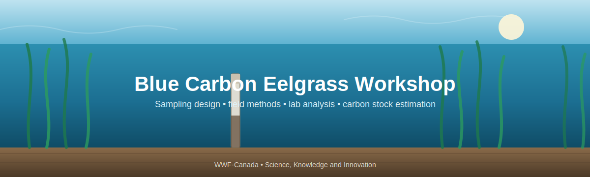

<p align="center">
  
</p>

# Blue Carbon Eelgrass Workshop

Materials from the **Blue Carbon Eelgrass Workshop** — measuring sediment carbon stocks in
seagrass and eelgrass (*Zostera marina*) meadows, from the background, through field methods, to
analysis in R and reporting

This workshop is organised in **four parts**. You can go through it in order, or jump to
any section you wish.

---

## Contents

| # | Section | What it covers |
|---|---------|----------------|
| 1 | [**Background**](01_Background/) | What blue carbon is and why it matters; key references (the Howard et al. Blue Carbon Manual); the workshop [slide deck]().|
| 2 | [**Project Planning**](02_Project_Planning/) | How many samples to take and where: area-based sample-size calculation (Cochran's formula) in the Excel calculator, stratified allocation, and the WWF-Canada sampling-design guide + tools. |
| 3 | [**Field Methods**](03_Field_Methods/) | Collecting sediment cores: equipment, the step-by-step coring workflow, the eelgrass field datasheet, and coring how-to videos. |
| 4 | [**Data Interpretation**](04_Data_Interpretation/) | Submitting samples to a lab, reading lab results, and the full eelgrass carbon analysis workflow (and report) in R. |


### Useful links

- **WWF-Canada Carbon Measurement library** — [wwf.ca/carbon-measurement](https://wwf.ca/carbon-measurement/)
- **Coastal Blue Carbon Field Guide** — [PDF](Coastal-Blue-Carbon-Field-Guide-FINAL.pdf) · [companion video playlist](https://www.youtube.com/playlist?list=PLLsjpJMfNDP5w78ZJNDUvMj1VoRG_qSwd)
- **Howard et al. Blue Carbon Manual** — [thebluecarboninitiative.org/manual](https://www.thebluecarboninitiative.org/manual)
- **Sampling design tools** — [interactive tool](https://blue-carbon-hub.projects.earthengine.app/) · [source code](https://github.com/WWF-Canada-SKI/Carbon-Measurement/tree/main/Blue%20Carbon/Sampling%20Design%20Tools)


---

## Objectives

The goal of the workshop is to:

1. **Learn about blue carbon in Canada** — what it is and why it matters.
2. **Learn field methods for measuring it** — how to collect and process sediment cores.
3. **Turn measurements into insight** — convert field data into an understanding of the ecosystem to inform decisions.

> **A good question to start with: How much carbon is stored in the sediment beneath an eelgrass meadow, and how confident are we in that number?**

Getting there means making good decisions at every stage — enough samples in the right
places ([Section 2](02_Project_Planning/)), collected correctly ([Section 3](03_Field_Methods/)),
measured by a lab, and analysed with methods that account for compaction, differing sample
depths, and spatial variation ([Section 4](04_Data_Interpretation/)).
[Section 1](01_Background/) provides background context and explains why blue carbon matters in Canada.

**TLDR: How carbon stock is calculated:**

1. Collect a sediment core
2. Measure how much sediment and carbon is in the core
3. Multiply these values
```
Carbon stock (kg C/m²) = SOC (g/kg) × bulk density (g/cm³) × layer thickness (cm) ÷ 100
```
Higher organic carbon concentration, denser sediment (higher bulk density), and deeper sediment (larger total core thickness) all mean
more carbon stored per square metre.

---

## Some resources to find in this workshop

- [`BlueCarbon_EelgrassPPT_FinalV1.pptx`](01_Background/BlueCarbon_EelgrassPPT_FinalV1.pptx) — the full workshop slide deck ([PDF version](01_Background/BlueCarbon_EelgrassPPT_FinalV1.pdf)).
- [`SampleDesign_SampleAllocationCalculator_WithStrata.xlsx`](02_Project_Planning/SampleDesign_SampleAllocationCalculator_WithStrata.xlsx) — the sample-size calculator.
- [`Eelgrass_Carbon_Datasheet_v2.pdf`](Eelgrass_Carbon_Datasheet_v2.pdf) — the field datasheet.
- **Coastal Blue Carbon Field Guide** — [PDF](Coastal-Blue-Carbon-Field-Guide-FINAL.pdf) · [companion video playlist](https://www.youtube.com/playlist?list=PLLsjpJMfNDP5w78ZJNDUvMj1VoRG_qSwd).
- [`04_Data_Interpretation/EelgrassWorkshop/`](04_Data_Interpretation/EelgrassWorkshop/) — the complete R analysis pipeline and report.

---

## Extra resources

- **Ecosystem Carbon Accumulation Visualizer** — [cathald.github.io/CarbonAccumulationVisualizer](https://cathald.github.io/CarbonAccumulationVisualizer/)
- **WWF-Canada Blue Carbon Sampling Design Tools** — [github.com/WWF-Canada-SKI/Carbon-Measurement](https://github.com/WWF-Canada-SKI/Carbon-Measurement/tree/main/Blue%20Carbon/Sampling%20Design%20Tools)

